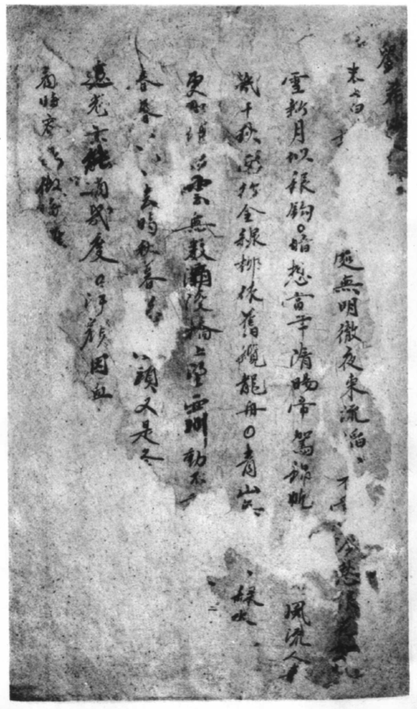
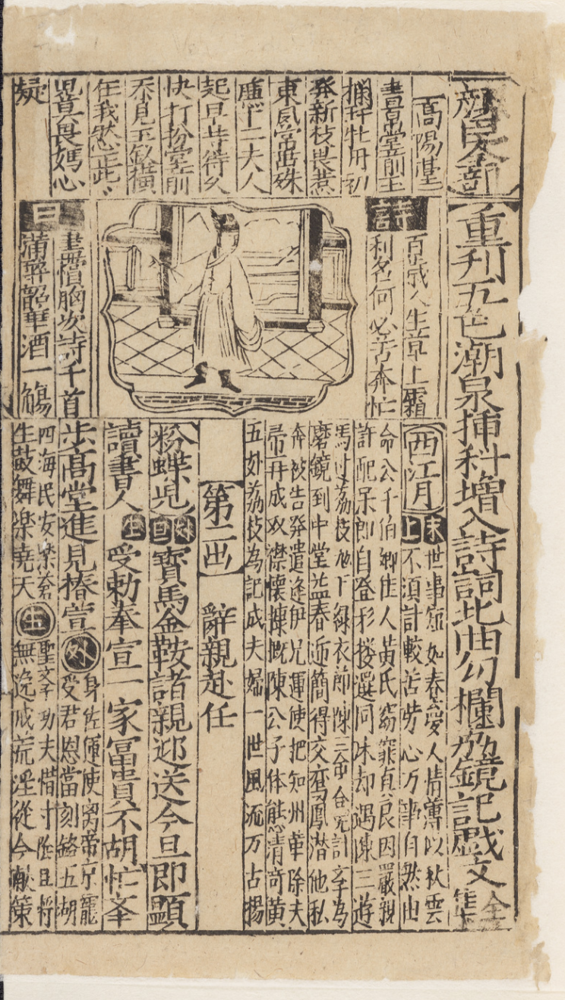
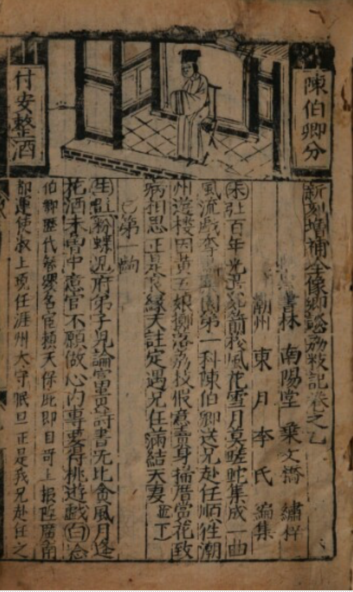
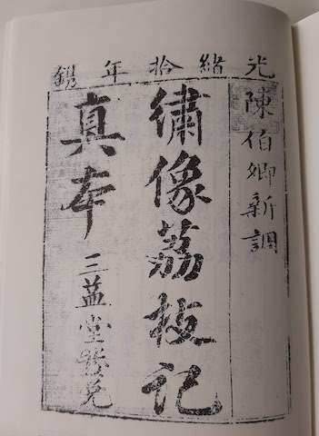
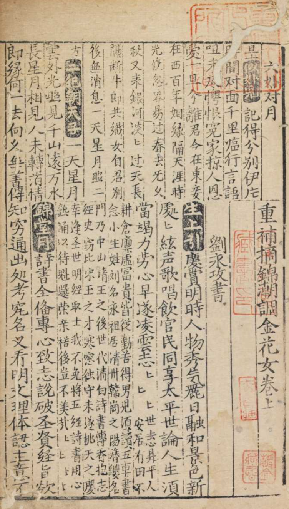

There is a centuries-old history of Teochew vernacular writing in Teochew opera
scripts (劇本 *giah-bung*). These historical scripts are rare surviving
examples of Chinese regional languages (“dialects”) in printed form. Some of
these books have been digitized and can be read online. However it can be
difficult to decipher these texts because they are laid out very differently
from modern books and playscripts. The written language is also likely to be
unfamiliar to most modern readers, because there are many variant or simplified
characters, as well as vocabulary and grammar not found in Mandarin or literary
Chinese.

Here we will list the historical editions and any reprints, digitizations, or
transcriptions that we are aware of, and also provide a short explainer on how
to read these texts.

List of historical Teochew opera scripts
----------------------------------------

Historical opera scripts include both hand-written manuscripts and printed
books. These must have been popular and widely circulated because they were
commercially printed and sold to the public. However, only a few examples
survive today, mostly in collections outside of China.

Five of the editions below have been reprinted in a facsimile edition,
《明本潮州戲文五種》(*Five Teochew opera scripts from the Ming era*,
广东人民出版社, 1985). Because two of these editions each contain two different
plays printed together, there is a total of seven plays. Fortunately for those
of us who are unable to find a copy of this valuable reprint, several of them
are now available as digitized versions online, which are linked below where
available. In some cases, the digital scans are in color and of high quality,
capturing more detail than the printed facsimile.

The Taiwanese scholar Wu Shouli [吳守禮](https://zh.wikipedia.org/wiki/吳守禮)
has published critical editions of Minnan opera works, including some of the
works listed below. 

### 《劉希必金釵記》 • *Lau-hi-bik Gim-toi-gi* • *Tale of the Golden Hairpin*

Manuscript, dated year 6 of the Ming Xuande 宣德 era (1431), recovered in an
archaeological excavation in 1975. In the collection of the Teochew Municipal
Museum.

Photographic reproduction in 《明本潮州戲文五種》 (source for the image below).

{:width="40%" style="display:block; margin-left:auto; margin-right:auto"}

Scholarly edition with extensive introductory chapters:
陈历明《潮州出土戏文珍本〈金钗记〉》（广州人民出版社，2012）

### 《蔡伯皆》 • *Cua Bêh-gai*

Manuscript dated to the Ming Jiajing 嘉靖 era (1521-1567), recovered in an
archaeological excavation in 1958. In the collection of the Guangdong
Provincial Museum.

Photographic reproduction in 《明本潮州戲文五種》.

### 《荔鏡記》 • *Li-gian-gi* • *Tale of the Lychee and Mirror*

This opera is also known as 《荔枝記》 *Li-gi-gi*, “*Tale of the Lychee
Branch*”.  The modern opera 《陳三五娘》 *Dang-san Ngou-niê* is based on the
same story.  The story is partly set in Quanzhou 泉州 (Tsuann-tsiu) and Teochew
prefectures, and a version is also performed in Quanzhou / Hokkien opera. As a
result, this opera has also been claimed as part of the heritage of
Hokkien-language opera, and is one of the “Four Great Works” of Taiwanese
歌仔戲 *kua-á-hì* opera.

Several historical editions have been rediscovered, suggesting that this was a
popular story, frequently adapted and re-printed. The oldest known editions are
from 1566 (below, left) and 1581 (below, right).

{:width="48%"} {:width="48%"}

#### Ming Jiajing 嘉靖 version 《重刊五色潮泉插科增入詩詞北曲勾欄荔鏡記戲曲全集》 (1566)

Published in year 45 of the Ming Jiajing 嘉靖 era (1566). There are two known
copies, one in the Bodleian Library of Oxford University, the other in the
Tenri Library, Japan. The Bodleian copy was rediscovered in the 1930s by Xiang
Da 向達.

This version is a mixture of Quanzhou 泉州 (Tsuann-tsiu) and Teochew source
editions. The text is printed together with excerpts from a Minnan play
《顏臣》 *Hian-cing*, and excerpts and arias from other plays; the *Li-gian-gi*
text is in the lower register of each page. 

Critical edition: Wu Shouli
吳守禮《明嘉靖刊荔鏡記戲文校理》，從宜出版社，2001年12月，ISBN 9869997481

Available reproductions:

* Photographic reproduction in 《明本潮州戲文五種》, based on the Tenri Library copy.
* [Digital scan, Oxford University Bodleian Library Sinica
  34/1](https://digital.bodleian.ox.ac.uk/objects/cb79b399-7272-4061-81e3-617828b50493/)
  and [34/2](https://digital.bodleian.ox.ac.uk/objects/0648fe4b-8463-490d-aa35-5d4ebf7af300/)
  (in color and higher resolution than the printed reproduction, source of
  the image above.)
* [Digital scan, Peking University Library facsimile edition, via Internet
  Archive](https://archive.org/details/02111377.cn); this scan appears to be
  based on the copy held in the Tenri Library, Japan.
* [Transcription, Academia Sinica Southern Min Archives database](http://cls.lib.ntu.edu.tw/southernmin/lm_wanli/origin1/all_Text.asp)
* [Transcription with notes by Wu Shou-li 吳守禮 and recitation in Zuan-ziu
  pronunciation by Li Limin 李麗敏, hosted by Taiwan Ministry of Culture](https://taiwanopera.moc.gov.tw/index/zh-tw/MirrorVideo)

#### Ming Wanli 萬曆 version 《新刻增補全像鄉談荔枝記》 (1581)

Published in the year 9 of the Ming Wanli 萬曆 era (1581). Said to be
representative of the Teochew editions; the first page states that it was
“compiled by Li Dong-ghuêh of Teochew prefecture” 「潮州東月李氏編集」. Held by
the Austrian National Library, rediscovered by Piet van der Loon in 1964.

Critical edition: Wu Shouli
吳守禮《明萬曆刊荔枝記戲文校理》，從宜出版社，2001年12月，ISBN 986999749X

Available reproductions:

* Photographic reproduction in 《明本潮州戲文五種》
* [Digital scan, Austrian National Library](https://onb.digital//result/1037167F) 
  (in color and higher resolution than the printed reproduction, source of
  the image above).
* [Transcription by Learn Teochew](https://github.com/learn-teochew/li-gi-gi-1581)

{:width="30%" style="display:block; margin-left:auto; margin-right:auto;"}

#### Other editions

Later versions of this play have also been preserved, and more may be
rediscovered in the future. However these other versions are not available
online. If you are aware of a publicly available digitization, please get in
touch!

* 《新𢳣潮調陳三泉南錦曲加調全集》 
  * Cover, preface, and postscript missing but dated to ca. 1600 by comparison to other publications. 
  * Held by the National Library of Scotland, Advocates’ Library 6.451. This edition was [rediscovered in 2019](https://hdl.handle.net/1842/36643) by a doctoral student at the University of Edinburgh, Wang Yibo. A critical edition is currently in preparation by Dr Wang.
* 《新刊時興泉潮雅調陳伯卿荔枝記大全》 
  * Published in year 8 of the Qing Shunzhi 順治 era (1651), private collection
  * Critical edition: Wu Shouli 吳守禮《清順治刊荔枝記戲文校理》，從宜出版社，2001年12月，ISBN 9869997309
* 《陳伯卿新調綉像荔枝記全本》
  * Published in year 11 of the Qing Daoguang 道光 era (1831), private collection
* 《陳伯卿新調繡像荔枝記真本》
  * Published in year 10 of the Qing Guangxu 光绪 era (1884); two copies, both held in private collections. 
  * Reprinted in《俗文學叢刊》第113冊 465-553頁 (民國91年, Taipei: Institute of History
    and Philology) (above), but this copy is incomplete: chapters after 安童尋主 are missing.
  * Critical edition: Wu Shouli 吳守禮《清光緒刊荔枝記戲文校理》，從宜出版社，2001年12月，ISBN 9869997317

### 《蘇六娘》 • Sou Lag-niê • Sixth Lady Sou

Probably printed during the Ming Wanli 萬曆 era (1572-1620).  The text was
printed together with another Teochew play 《金花女》 *Gim-huê-neng* in the
same volume (see below).  The text of *Sou Lag-niê* is in the upper register of
each page, whereas *Gim-huê-neng* is in the lower register. The volume was
formerly in the collection of Nagasawa Kikuya 長澤規矩也, and is now preserved
in Tokyo University (source of the image below).

{:width="40%" style="display:block; margin-left:auto; margin-right:auto"}

This historical edition contains a selection of eleven scenes from the play, so
there are some logical gaps in the story. The modern opera of the same name is
based on the same story, which has a similar theme as *Dang-san Ngou-niê*, and
is also still one of the most popular Teochew operas.

Critical edition: Wu Shouli 吳守禮《明萬曆刊蘇六娘戲文校理》，從宜出版社，2002年7月，ISBN 9574103331

Available reproductions:

 * Photographic reproduction in 《明本潮州戲文五種》
 * [Digital scan, Tokyo University IASA Library
   D8423400](http://shanben.ioc.u-tokyo.ac.jp/main_p.php?nu=D8423400&order=rn_no&no=01753)
 * [Transcription, Academia Sinica Southern Min Archives
   database](http://cls.lib.ntu.edu.tw/southernmin/su_liu_niang/all_Text.asp)

### 《金花女》 • Gim-huê-neng • Golden Flower Lady

Printed together in the same volume with *Sou-lag-niê* (see above). 

Critical edition: Wu Shouli
吳守禮《明萬曆刊金花女戲文校理》，從宜出版社，2002年7月，ISBN 9574103323

Available reproductions:

 * Photographic reproduction in 《明本潮州戲文五種》
 * [Digital scan, Tokyo University IASA Library
   D8423400](http://shanben.ioc.u-tokyo.ac.jp/main_p.php?nu=D8423400&order=rn_no&no=01753)
 * [Transcription, Academia Sinica Southern Min Archives
   database](http://cls.lib.ntu.edu.tw/southernmin/jin_hua_nv/all_Text.asp)

NB: Images on this page are low-resolution copies for illustrative purposes
only. Rights belong to the copyright holders. See text for sources.

How to read historical opera scripts
----------------------------------------

Watch this space!

## Further reading

 * 《明本潮州戏文五种》，，1985年
 * 曾宪通，〈明本潮州戏文所见潮州方言述略〉，《方言》 1991年 (1) : 10-29
 * Piet van der Loon. 1992. *The classical theatre and art song of South
   Fukien: A study of three Ming anthologies*. Taipei: SMC Publishing. ISBN
   9789576381072
 * Lucille Chia. 2002. *Printing for profit: the commercial publishers of
   Jianyang, Fujian (11th-17th centuries)*. Harvard-Yenching Institute
   Monograph Series 56. Cambridge, Massachusetts: Harvard University Asia
   Center. ISBN 9780674009554
